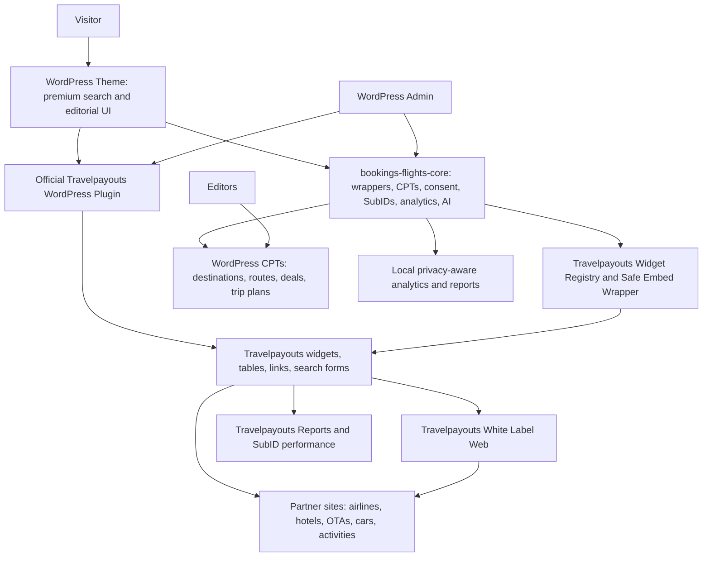

# Travelpayouts WordPress Booking Site Architecture Blueprint

Date: 2026-05-09

Status: Proposed implementation blueprint

Scope: WordPress website architecture, frontend product plan, Travelpayouts-controlled search/booking backend, phase plan, and validation gates for Bookings and Flights.

## Executive Direction

Bookings and Flights should become a premium WordPress-native travel discovery and affiliate conversion site. The user-facing experience should feel competitive with leading travel products for flights and hotels, while the booking backend remains controlled by Travelpayouts tools, widgets, White Label, partner links, and the official Travelpayouts WordPress plugin wherever it is compatible.

This is not a direct online travel agency. The site should not sell tickets, collect hotel payments, issue booking confirmations, manage refunds, or own supplier inventory. WordPress owns the brand, editorial content, SEO pages, design shell, saved-trip experience, AI planning workflow, consent, and admin governance. Travelpayouts owns monetized travel search, widget inventory, affiliate links, partner redirects, White Label result surfaces, and payout/reporting source of truth.

## Non-Negotiable Architecture Rules

- Travelpayouts is the primary backend for flights, hotels, cars, activities, and partner booking handoff.
- Use the official Travelpayouts WordPress plugin and Travelpayouts widgets first when compatible.
- If the official plugin fails compatibility checks, use Travelpayouts dashboard-generated widget/White Label embed code inside a secured WordPress wrapper. Do not replace it with a custom OTA backend.
- Booking and payment happen on Travelpayouts White Label or partner sites, not inside WordPress.
- WordPress remains the source of truth for content, pages, CPTs, editorial state, settings, consent, disclosures, and admin workflows.
- `bookings-flights-core` may wrap, place, track, and govern Travelpayouts placements, but it must not become a custom flight/hotel inventory engine.
- `platform/` remains optional integration infrastructure and must not replace the WordPress product baseline or Travelpayouts backend without a documented decision.
- Public pages must include affiliate disclosure where monetized widgets, links, cards, or search flows appear.
- Provider credentials, API tokens, partner IDs, and secrets must never be exposed in HTML, JavaScript, REST responses, logs, or admin notices.

## Current Workspace Alignment

The workspace already contains the right foundation for this direction:

- `plugins/bookings-flights-core/`: WordPress-native core plugin with CPTs, REST foundations, settings, affiliate card handoff, AI itinerary workflow, cron, reports, and capability boundaries.
- `plugins/bookings-and-flights-affiliate-bridge/`: existing affiliate credential/settings bridge.
- `plugins/bookings-and-flights-content-manager/`: content editing helper for the static theme.
- `themes/bookings-and-flights-static/`: current classic WordPress theme with a travel search style homepage and supporting content pages.
- `themes/bookings-and-flights-headless/`: headless shell, not the preferred path for this WordPress-native direction unless explicitly approved.
- `platform/`: Next.js/Fastify monorepo with search API concepts, but it should not be treated as the canonical booking/search backend for this Travelpayouts-first plan.

Important reconciliation:

- The existing static homepage has a search shell and travel layout, but it currently uses placeholder prices, partner names, SVG icons, and gradient-heavy hero treatment. A competitive redesign should replace these placeholders with Travelpayouts-controlled widgets, Travelpayouts-safe claims, actual visual travel assets, responsive states, and clear handoff flows.
- The current core plugin has `GET /search/flights` and `GET /search/hotels` listed as planned REST routes. Under this blueprint, those routes should not become custom inventory APIs. If implemented, they should only return safe local shell configuration, redirect metadata, or status needed to render Travelpayouts-controlled surfaces.

## Research Consulted

- WordPress Plugin Developer Handbook: plugin structure, settings, shortcodes, REST, hooks, cron, and privacy.
- WordPress Plugin Security Handbook: capability checks, nonces, validation, sanitization, escaping, and sensitive-data handling.
- WordPress REST API Handbook: endpoint registration, permission callbacks, request validation, and response conventions.
- WordPress Theme Developer Handbook: classic/block theme boundaries, templates, assets, global styles, patterns, accessibility, and testing.
- WordPress Block Editor Handbook: block-based editing and frontend/admin block surfaces.
- Travelpayouts Help Center: Travelpayouts WordPress plugin, installation, general plugin settings, adding widgets/tables/links, widget setup, White Label, ID/SubID behavior.
- WordPress.org Travelpayouts plugin page: current plugin metadata and compatibility warning.
- Competitive current references: Booking.com homepage/category breadth, Expedia Trip Planner, Google Flights flexible dates/price tracking, Skyscanner Everywhere/cheapest month/price alerts, KAYAK search/help/AI planning and price alerts.

## Target Product Positioning

The site should compete on discovery, speed, clarity, and planning rather than pretending to own inventory.

Positioning statement:

> Bookings and Flights helps travelers discover where to go, compare flights and hotels through Travelpayouts-powered tools, plan smarter trips with AI, save ideas, track alerts, and book with trusted partner sites.

Primary conversion paths:

1. Homepage search to Travelpayouts-powered flight/hotel results.
2. Destination guide to contextual flight, hotel, activity, and car widgets.
3. Route page to flexible-date flight widgets, price alerts, and White Label results.
4. AI itinerary to monetized travel cards and Travelpayouts widgets.
5. Saved trip or alert signup to return visits and affiliate handoff.

## System Architecture



## Responsibility Matrix

| Area | Owner | Notes |
| --- | --- | --- |
| Page design, templates, navigation, responsive layout | WordPress theme | Must visually compete with top booking sites. |
| Editorial content and SEO pages | WordPress CPTs/theme | Destination, route, hotel city, deal, and itinerary pages. |
| Flight/hotel search forms | Travelpayouts plugin/widgets/White Label | WordPress can provide the shell and placement only. |
| Search results inventory and pricing | Travelpayouts | Do not store canonical live inventory in WordPress. |
| Booking and payment | Partner site via Travelpayouts | No direct checkout in WordPress. |
| Affiliate ID, widgets, links, SubID reports | Travelpayouts | WordPress mirrors only safe placement metadata. |
| SubID naming strategy | `bookings-flights-core` plus Travelpayouts | Use consistent, readable SubIDs per placement. |
| AI itinerary planning | `bookings-flights-core` | AI recommends and prepares; it does not book or publish directly. |
| Saved trips and alerts | WordPress | Store local user intent, not supplier inventory ownership. |
| Local analytics | WordPress | Privacy-aware content and placement analytics only. |
| Revenue reporting | Travelpayouts source of truth | WordPress may link out or import safe summaries only if approved. |

## Travelpayouts Backend Contract

### Official Plugin First

Install and validate the official `travelpayouts` WordPress plugin before building custom wrappers. The plugin documentation describes widgets, tables, links, flight/hotel search forms, account token/Partner ID setup, traffic source selection, White Label fields, general settings, language, currency, action after click, nofollow behavior, caching, and script placement.

Compatibility gate:

- WordPress.org currently shows the Travelpayouts plugin at version `1.2.2`, last updated recently, with 7,000+ active installations.
- WordPress.org also warns that the plugin has not been tested with the latest three major WordPress releases.
- Treat this as a mandatory local compatibility test before relying on plugin blocks in production.

Acceptance for plugin use:

- Plugin activates without fatal errors on the local WordPress version.
- Admin account setup accepts Token and Partner ID.
- Traffic source selection works.
- A flight search form can be embedded in a test page.
- A hotel widget/table can be embedded in a test page.
- Generated frontend HTML does not expose API tokens.
- Generated links include the intended Partner ID/SubID behavior.
- Widgets work on desktop and mobile without layout breakage.

### Widget and White Label Fallback

If the plugin is not production-safe, do not build a replacement backend. Use Travelpayouts dashboard-generated code:

- Flight search form widget.
- Hotel search or hotel map widgets.
- Popular routes widgets.
- Low-price calendar widgets.
- Route map widgets.
- Partner links and tables.
- White Label Web widget or page.

The WordPress side should provide a `baf` wrapper that:

- stores only safe placement metadata;
- renders the official embed code from a capability-gated admin source;
- keeps scripts scoped to pages where the widgets are used;
- adds affiliate disclosure;
- generates consistent SubIDs;
- includes loading, no-script, and missing-configuration states;
- does not alter Travelpayouts JavaScript in a way that breaks tracking.

### White Label Strategy

Use White Label Web for on-site flight search results when the user should not immediately leave the site. Prefer:

- White Label widget for embedded results within a WordPress-designed page.
- White Label page on a subdomain for fuller search/result flows if the widget cannot support the desired UX.

Branded header requirement:

- White Label search/result pages must visually inherit the Bookings and Flights home-site header treatment so users experience one continuous product, not a redirected partner surface.
- The preferred path is the White Label widget type embedded inside a WordPress page, because the WordPress header, navigation, disclosure, and page shell remain fully controlled by the theme while Travelpayouts controls the search/results module.
- If the White Label Page type is required, configure Travelpayouts White Label header options to match the home site: logo, brand name, favicon, header background color or image, header/footer menu links, typography/color approximations, and search-heading copy.
- Page-type White Label header links should mirror the WordPress primary navigation where Travelpayouts settings allow it: Flights, Hotels, Explore, Deals, Trip Planner, Saved Trips, and Support.
- The White Label header must include a clear route back to the main WordPress site and should not display unrelated Travelpayouts/default branding if Travelpayouts customization supports replacing it.
- Implementation should document any visual differences that cannot be controlled inside Travelpayouts White Label settings and compensate with the WordPress page shell where possible.

Important constraints:

- White Label booking still redirects to a partner agency or brand for booking/payment.
- White Label is a CNAME plus Travelpayouts account styling/configuration.
- Travelpayouts Page-type White Label supports additional appearance settings such as logo image, brand/search-form heading text, favicon, header color or image, and header/footer menus; Widget-type keeps the WordPress page header because results are embedded in the existing page.
- Travelpayouts notes that White Label is closed from search engine crawlers except the main page, so SEO landing pages should remain WordPress pages with search forms/widgets, not only White Label pages.
- Domain/subdomain names must not include restricted travel brand names.
- Booking.com fares are not available on White Label due to Booking.com policy, so hotel strategy must use approved Travelpayouts widgets/program links rather than promising Booking.com inventory inside White Label.

### SubID Strategy

Use lowercase Latin letters, numbers, and underscores. Travelpayouts supports SubIDs on links, widgets, and White Label URLs. Locally, keep SubIDs short enough for reporting readability.

Recommended pattern:

```text
{channel}_{surface}_{vertical}_{slug}_{placement}
```

Examples:

```text
seo_route_flights_jfk_lhr_hero
home_widget_hotels_search
ai_trip_flights_lisbon_card
email_alert_flights_chi_anywhere
```

Rules:

- Never reuse the same SubID for unrelated placements.
- Include page or CPT context where possible.
- Use one SubID per conversion placement, not per user.
- Do not include names, emails, IPs, raw prompt text, or private trip details in SubIDs.

## Frontend Product Blueprint

### Competitive Experience Principles

The frontend should borrow the proven patterns users expect from leading travel sites without copying their brand or becoming a direct booking engine.

Core experience signals:

- Fast tabbed search for flights, hotels, cars, activities, and packages.
- Flexible-dates and "anywhere" discovery modes.
- Price alert and watchlist affordances.
- Map and visual destination browsing.
- Strong filters and comparison cues.
- Trust and transparency around affiliate handoff.
- AI planning as an assistant beside search, not as an unverified booking engine.
- Mobile-first layout that remains dense, scannable, and conversion-focused.

### Primary Site Map

| Page | Purpose | Travelpayouts surface |
| --- | --- | --- |
| Home | Primary search, inspiration, trust, AI entry | Flight/hotel search widgets, White Label entry |
| Flights | Dedicated flight search and flexible-date discovery | Flight search form, low-price calendar, route map |
| Hotels | Dedicated stays search and city hotel discovery | Hotel search widget, hotel map/calendar widgets |
| Explore | Anywhere/flexible destination discovery | Popular destination widgets, route maps, editorial cards |
| Destinations | SEO index for destination CPTs | Contextual flight/hotel/activity widgets |
| Destination detail | Guide plus monetized travel modules | Flight widget, hotel widget, activities links |
| Routes | SEO index for origin-destination routes | Popular routes/low-price widgets |
| Route detail | Flight route intent page | Route-specific flight widgets, alerts, White Label link |
| Deals | Editorial deals and seasonal pages | Partner links/widgets with SubIDs |
| AI Trip Planner | Natural-language planning workflow | Travelpayouts cards/widgets from approved outputs |
| Saved Trips | Member retention and planning board | Saved local intent with fresh Travelpayouts handoff |
| Alerts | Route/watchlist signup | Local alert intent, Travelpayouts handoff when clicked |
| About/Legal | Trust, affiliate disclosure, privacy, terms | No inventory surface except disclosures |

### Homepage Blueprint

Above the fold:

- Header with clear nav: Flights, Hotels, Explore, Deals, Trip Planner, Saved Trips.
- Full-bleed real travel image or video-backed hero, not a gradient-only hero.
- Compact value copy: search, compare, book with trusted partners.
- Travelpayouts-powered unified search panel.
- Tabs for Flights, Hotels, Cars, Activities, Packages.
- Search fields match each vertical while remaining visually consistent.
- Visible affiliate transparency near the search panel.
- A secondary AI prompt input: "Plan a 4-day beach trip under $1,200."

Below the fold:

- Trending routes and destinations, using either editorial CPT data or Travelpayouts widgets.
- Flexible dates and cheap-month module.
- Hotel city discovery module with map/search widget.
- Explore-anywhere module for flexible travelers.
- Price alert CTA.
- AI itinerary teaser with editable trip cards.
- Editorial guide cards for SEO depth.
- Trust and support band explaining that booking happens on partner sites.
- Footer with affiliate disclosure, privacy, terms, support, and destination indexes.

### Flights Experience

Required modules:

- Hero flight search powered by Travelpayouts.
- Origin, destination, dates, travelers, cabin, direct-only, nearby-airports, flexible-date toggles.
- Low-price calendar widget.
- Popular route widgets for origin pages.
- Route map or destination map.
- Price alert signup for logged-in and anonymous users.
- "Book now or wait" guidance only when based on available trend data and labeled as guidance.
- Clear partner handoff message before redirects.

SEO page families:

- Cheap flights from `{origin}`.
- Flights from `{origin}` to `{destination}`.
- Cheapest month to fly to `{destination}`.
- Weekend trips from `{origin}`.
- Direct flights to `{destination}`.

### Hotels Experience

Required modules:

- Hotel/stays search widget from Travelpayouts-supported program surfaces.
- City hotel landing pages.
- Map-first hotel discovery when the selected widget supports it.
- Filters presented in the WordPress shell: budget, family, luxury, beach, business, neighborhood, amenities. Filters must not claim to filter live supplier results unless the Travelpayouts widget actually supports them.
- Editorial hotel guide cards that link into Travelpayouts widgets/partner links.
- Clear external booking handoff language.

SEO page families:

- Best hotels in `{city}`.
- Where to stay in `{city}`.
- Family hotels in `{city}`.
- Luxury hotels in `{city}`.
- Budget hotels near `{landmark}`.

### Destination and Route Content Model

Destination pages should combine editorial authority with monetized utility:

- Hero image, destination facts, best time to visit.
- Flight search widget scoped to destination.
- Hotel widget or map scoped to destination.
- Neighborhood and stay recommendations.
- Activities/tours partner links.
- Seasonal modules.
- Related routes and nearby destinations.
- AI itinerary CTA.
- Affiliate disclosure and external booking language.

Route pages should be more transactional:

- Origin/destination summary.
- Flight widget/White Label entry.
- Low-price calendar.
- Travel time and airport notes.
- Flexible date guidance.
- Price alert CTA.
- Related routes.
- Hotels and activities module at the destination.

### AI Planner Contract

AI may:

- ask clarifying questions;
- turn natural language into a trip brief;
- generate destination ideas and day-by-day itineraries;
- recommend which Travelpayouts widgets/cards to display;
- generate draft trip plans;
- prepare saved-trip or alert records after user approval.

AI may not:

- invent live prices;
- claim availability not provided by Travelpayouts tools;
- auto-book;
- auto-publish;
- bypass consent;
- send private user data to external providers without permission.

AI output should end in editable WordPress-native cards and Travelpayouts-powered CTAs.

## WordPress Implementation Architecture

### Theme Ownership

Continue with `themes/bookings-and-flights-static` unless a later decision approves a block theme migration. The theme should own:

- premium public page templates;
- responsive layout;
- design tokens;
- navigation;
- Travelpayouts widget placement zones;
- visual editorial components;
- accessibility and performance behavior.

Theme refactor guidance:

- Split oversized CSS before adding large new design work.
- Replace gradient-only hero treatments with real travel media.
- Use scoped, compact modules rather than nested card-heavy sections.
- Keep core booking/search widgets unbroken by theme CSS.
- Avoid claims that imply the site owns inventory, fares, or bookings.

### Core Plugin Ownership

`plugins/bookings-flights-core` should own:

- CPTs, taxonomies, meta, capabilities, settings, and admin screens.
- Travelpayouts settings bridge and compatibility checks.
- Widget placement registry.
- Safe embed wrapper shortcodes/blocks.
- SubID generation.
- Affiliate disclosures.
- Consent and privacy gates.
- AI itinerary service and draft trip plan records.
- Saved trips and alert intent records.
- Privacy-aware analytics and reporting.

Planned additions:

- `BAF\Core\Travelpayouts\Widget_Registry`
- `BAF\Core\Travelpayouts\Widget_Placement`
- `BAF\Core\Travelpayouts\SubID_Builder`
- `BAF\Core\Frontend\Travelpayouts_Widget_Shortcode`
- `BAF\Core\Blocks\Travelpayouts_Widget_Block`
- `baf_travelpayouts_widget_registry` option for safe placement metadata

Architecture deepening priorities:

- The Travelpayouts placement registry should be the deep module for approved placement metadata, consent checks, affiliate disclosure, SubID generation, safe embed output, missing-configuration states, and official-plugin-versus-fallback Adapter selection.
- Search/result pages should call through a search surface mode seam that chooses Travelpayouts widget, White Label page, safe redirect metadata, or an explicitly approved `platform/` Adapter. It must not expose a custom live inventory Interface by accident.
- Brand continuity should have one WordPress-owned module or documented source that feeds the theme header, WordPress result pages, and Page-type White Label configuration values: logo, favicon, brand name, colors, primary nav, footer links, disclosure copy, and search-heading copy.
- AI itinerary opportunities should pass through an approval-oriented handoff module before becoming Travelpayouts placements. AI may recommend placement drafts; it must not book, publish, execute provider searches, or create monetized output without WordPress capability and consent checks.
- The existing content manager should be split along field rendering, field persistence, media portability, schema export/import, and admin notice seams before large template/content expansion depends on it further.

The core plugin should not:

- scrape Travelpayouts output;
- store live fares as canonical inventory;
- replace Travelpayouts results with custom API search;
- proxy bookings or payments;
- hide the partner handoff.

### Official Travelpayouts Plugin Ownership

The official plugin should own:

- Travelpayouts account connection.
- Token and Partner ID configuration.
- Plugin-provided block/tool insertion.
- Widgets, tables, search forms, and links when compatible.
- Widget-specific settings and generated shortcodes.
- Host/White Label setting for flight and hotel search results.

### Affiliate Bridge Ownership

`bookings-and-flights-affiliate-bridge` should remain a compatibility/status layer unless a later phase consolidates it:

- Preserve existing options until migration is approved.
- Do not duplicate official Travelpayouts plugin secrets into public output.
- Keep `/wp-json/baf/v1/config` safe and secret-free.
- Keep `/wp-json/baf/v1/status` protected.

### REST Strategy

REST routes should support WordPress-owned content and local workflow state. They should not become a custom Travelpayouts replacement.

Allowed:

- public destination and route collections;
- AI itinerary generation behind `run_baf_ai`;
- saved-trip and alert endpoints with consent and capability checks;
- signed affiliate click handoff for local cards;
- widget registry reads that expose only safe placement metadata.
- search surface configuration endpoints that return safe placement, redirect, or White Label metadata without returning live supplier inventory.

Avoid:

- `GET /search/flights` returning live inventory from custom APIs;
- `GET /search/hotels` returning live hotel inventory from custom APIs;
- any endpoint that exposes API tokens, raw widget code to unauthorized users, or private user trip data.

### Data Strategy

Store in WordPress:

- destinations;
- routes;
- deals;
- trip plans;
- alert intent;
- widget placement metadata;
- consent records;
- safe click/search/session analytics;
- editorial status and approvals.

Keep in Travelpayouts:

- live flight inventory;
- live hotel inventory;
- widget search results;
- White Label result pages;
- partner booking and payment;
- affiliate revenue and conversion source of truth.

Optional local tables should be treated as analytics and workflow state only, not supplier inventory ownership.

### Platform Integration Strategy

`platform/` can remain useful as an integration layer, demo surface, or future explicitly approved direct Adapter host. It should not be the default search/result owner for the WordPress-native product.

Before any future phase routes WordPress users through `platform/` search results, document:

- why Travelpayouts official plugin/widgets/White Label do not satisfy the required surface;
- which search surface mode is active;
- what data crosses the WordPress/platform seam;
- how secrets remain server-side;
- how affiliate disclosure and SubIDs are preserved;
- how the flow avoids becoming a custom OTA backend.

## Design System Requirements

Visual direction:

- Premium, fast, confident, global travel search.
- Use real destination and travel media.
- Avoid a one-note blue/slate palette. Keep blue as a trust color, then add warm accents, green deal cues, neutral surfaces, and image-led contrast.
- Avoid oversized generic marketing cards. The interface should feel like a working search product.
- Cards should stay restrained with small radius unless a component requires otherwise.
- Search modules should be dense but touch-friendly.

Core components:

- Unified search panel.
- Branded White Label result shell.
- Vertical tabs.
- Flight route picker.
- Hotel destination picker.
- Date range and flexible-date controls.
- Traveler/cabin controls.
- Filter chips.
- Price alert CTA.
- Travelpayouts widget frame.
- Affiliate disclosure component.
- Destination card.
- Route card.
- Hotel guide card.
- AI itinerary card.
- Saved trip board.
- Admin widget placement table.

Accessibility and responsive behavior:

- 44px minimum touch targets for primary controls.
- Keyboard-operable tabs, menus, modals, and widget placement UI.
- Visible focus states.
- Screen-reader labels for icon controls.
- No text overlap on mobile.
- No layout shift around widget loading.
- No hidden affiliate disclosure on mobile.
- Reduced-motion support.

Performance:

- Do not load Travelpayouts scripts site-wide unless required by the official plugin.
- Lazy-load below-the-fold widgets where Travelpayouts supports it.
- Reserve dimensions for widgets to avoid layout shift.
- Defer noncritical theme scripts.
- Optimize media and use responsive image sizes.
- Keep homepage critical path lean.

## Implementation Plan

### Phase 10: Blueprint Documentation and Contract Alignment

Status: Completed by this document.

Objective: Reconcile the Travelpayouts-first product direction with the existing WordPress architecture, baseline contracts, and future phase plan.

Deliverables:

- This blueprint.
- Architecture baseline update for the Travelpayouts-controlled backend boundary.
- Decision log entry for Travelpayouts as the booking/search backend.
- Future Phase 11 through Phase 19 implementation plan.

Validation:

- Documentation-only review.
- Existing `.plan/` files inspected.
- Current plugins, themes, and platform boundary inspected.
- Official WordPress and Travelpayouts documentation consulted.

### Phase 11: Travelpayouts Compatibility and Backend Alignment

Objective: Confirm that Travelpayouts can control the monetized backend safely in this WordPress environment.

Scope:

- Install or stage the official Travelpayouts plugin.
- Verify activation on the local WordPress version.
- Configure a test Token, Partner ID, traffic source, and optional White Label URL using non-production-safe test procedure or documented manual setup.
- Create test pages for flight search, hotel widget/table, and White Label result handoff.
- Verify whether White Label results can use the WordPress-owned header via Widget type or must use a Page-type Travelpayouts-customized header.
- Configure or document the Page-type White Label header assets: logo URL, favicon URL, brand name, header background, menu links, footer links, and search-heading copy.
- Decide plugin-first or dashboard-embed fallback.
- Update `.plan/architecture-baseline.md`, `.plan/known-issues.md`, and `.plan/validation-baseline.md`.

Files likely to change:

- `.plan/architecture-baseline.md`
- `.plan/validation-baseline.md`
- `.plan/known-issues.md`
- `plugins/bookings-flights-core/includes/settings/`
- `plugins/bookings-flights-core/includes/travelpayouts/` if wrappers are added

Acceptance criteria:

- Travelpayouts plugin or fallback path is confirmed.
- No direct booking or custom inventory engine is introduced.
- Plugin/widget setup does not expose secrets.
- White Label requirements and limitations are documented.
- White Label search/results pages preserve home-site header continuity through embedded Widget type or Travelpayouts Page-type header customization.
- SubID strategy is documented.

Validation:

- Plugin activation/deactivation check.
- Admin setup smoke check.
- Frontend widget render smoke check.
- White Label header continuity review against the WordPress homepage header.
- Mobile/desktop browser check.
- Secret exposure source review.

### Phase 12: Information Architecture and Competitive Design System

Objective: Redesign the WordPress frontend structure to match the clarity and density of top booking sites while preserving WordPress-native editability.

Scope:

- Finalize sitemap and navigation.
- Define design tokens, component inventory, responsive breakpoints, and media strategy.
- Split oversized CSS files before heavy additions.
- Document widget frame dimensions and loading states.
- Create page-level wireframes for home, flights, hotels, destination, route, deals, AI planner, and saved trips.

Files likely to change:

- `themes/bookings-and-flights-static/assets/css/`
- `themes/bookings-and-flights-static/ARCHITECTURE.md`
- `.plan/travelpayouts-wordpress-booking-site-blueprint.md`

Acceptance criteria:

- Layout supports Travelpayouts widgets without clipping or layout shift.
- Homepage first viewport clearly signals flights and hotels.
- Mobile search is first-class.
- Design uses real travel media.
- Accessibility requirements are documented before implementation.

Validation:

- Static template review.
- Responsive wireframe review.
- CSS file-size review.
- Browser screenshot plan documented.

### Phase 13: Travelpayouts Widget Registry and Safe Embed Layer

Objective: Give editors controlled ways to place Travelpayouts widgets without scattering raw scripts through content.

Scope:

- Add a widget placement registry in the core plugin.
- Add admin UI for placement name, vertical, page context, SubID pattern, embed code, and status.
- Add shortcode/block wrapper for approved placements.
- Add disclosure and missing-configuration states.
- Allow official plugin block usage where compatible.

Files likely to change:

- `plugins/bookings-flights-core/includes/admin/`
- `plugins/bookings-flights-core/includes/settings/`
- `plugins/bookings-flights-core/includes/frontend/`
- `plugins/bookings-flights-core/assets/`
- `.plan/architecture-baseline.md`

Acceptance criteria:

- Only users with `manage_baf_affiliates` or `manage_baf_settings` can manage raw widget/embed code.
- Raw embed code is not exposed through public REST.
- Frontend wrapper renders configured, missing, disabled, loading, and no-script states.
- SubIDs follow the documented naming convention.
- Affiliate disclosure is visible.

Validation:

- PHP syntax checks.
- Plugin activation check.
- Admin capability and nonce checks.
- Frontend render check.
- Secret and script exposure review.

### Phase 14: Homepage Competitive Rebuild

Objective: Replace the current placeholder homepage with a Travelpayouts-powered, image-led travel search homepage.

Scope:

- Real hero media.
- Travelpayouts-powered unified search.
- Flights and hotels first; cars/activities/packages as secondary tabs where supported.
- Trending destinations/routes driven by CPTs or Travelpayouts widgets.
- Explore-anywhere module.
- Price alert CTA.
- AI planner entry.
- Trust, disclosure, and partner handoff messaging.

Files likely to change:

- `themes/bookings-and-flights-static/page-home.php`
- `themes/bookings-and-flights-static/assets/css/`
- `themes/bookings-and-flights-static/assets/js/`
- `plugins/bookings-flights-core/includes/frontend/` if widget wrappers are used

Acceptance criteria:

- No placeholder prices or unverified partner claims remain.
- Search actions land on Travelpayouts-controlled widgets, White Label, or approved partner links.
- Homepage looks polished on desktop and mobile.
- Disclosures are visible and readable.
- Travelpayouts scripts load only where needed.

Validation:

- PHP syntax checks for changed templates.
- Browser screenshots at mobile, tablet, desktop.
- Keyboard navigation check.
- Widget render and handoff smoke check.
- Header continuity check between WordPress search entry page and White Label result surface.
- No secret exposure in source.

### Phase 15: Flights Experience

Objective: Build a flight-first experience that competes with Google Flights, Skyscanner, and KAYAK patterns while using Travelpayouts for results and handoff.

Scope:

- Flights landing page.
- Route pages.
- Origin "cheap flights from" pages.
- Low-price calendar widgets.
- Popular routes widgets.
- White Label result flow.
- Price alert signup.

Acceptance criteria:

- Flight searches route into Travelpayouts-controlled results.
- Flexible-date and anywhere modes are honest about what Travelpayouts supports.
- Route pages are indexable WordPress content.
- Alerts store local intent without claiming live fare ownership.

Validation:

- REST/public content smoke checks.
- Widget and White Label handoff checks.
- Header continuity check for White Label result flow.
- Alert permission and nonce checks if forms are added.
- SEO metadata/source review.

### Phase 16: Hotels and Stays Experience

Objective: Build a strong hotels discovery experience without falsely claiming direct property inventory ownership.

Scope:

- Hotels landing page.
- City hotel guides.
- Hotel widgets/tables/maps from Travelpayouts-supported programs.
- Editorial neighborhood and stay-type cards.
- Hotel-specific SubID placements.

Acceptance criteria:

- Hotel discovery uses Travelpayouts widgets, links, or approved program tools.
- Filters in WordPress are editorial unless connected to supported Travelpayouts widget behavior.
- Booking handoff and disclosures are clear.

Validation:

- Widget render checks.
- Mobile map/widget layout checks.
- Source review for secret exposure.
- Editorial page SEO checks.

### Phase 17: Destination, Route, and SEO Content Engine

Objective: Scale organic landing pages around WordPress CPTs and Travelpayouts placements.

Scope:

- Destination templates.
- Route templates.
- Deal templates.
- Taxonomy archive templates.
- Editorial modules for best time to visit, where to stay, nearby routes, activities, and trip ideas.
- Internal linking rules.

Acceptance criteria:

- Pages are editable in WordPress.
- Monetized modules are controlled by approved widget placements.
- No generated page auto-publishes without editor approval.
- Affiliate disclosure appears on every monetized page.

Validation:

- CPT archive and single-template checks.
- Accessibility and responsive review.
- SEO source review.
- Editor workflow smoke check.

### Phase 18: AI Planner With Travelpayouts Handoff

Objective: Turn AI itinerary planning into a conversion assistant that remains honest about Travelpayouts-controlled inventory.

Scope:

- AI planner page.
- Prompt-to-trip brief.
- Day-by-day itinerary.
- Editable trip plan draft.
- Travelpayouts widget/card recommendations.
- Save trip and alert CTAs.

Acceptance criteria:

- Demo mode works without live AI credentials.
- Live AI requires consent and configuration.
- AI does not invent live prices.
- AI cannot book, pay, or publish.
- Travelpayouts CTAs remain user-approved handoffs.

Validation:

- AI REST smoke and permission tests.
- Missing-key and missing-consent tests.
- Schema validation checks.
- Prompt/output secret review.

### Phase 19: Saved Trips, Alerts, Analytics, and Release Readiness

Objective: Keep users returning without taking ownership of supplier bookings, then validate that the full WordPress frontend and Travelpayouts backend path is secure, fast, responsive, and measurable.

Scope:

- Saved trip board.
- Anonymous-to-member save flow.
- Price alert intent.
- Email follow-up hooks where approved.
- "Resume planning" links.
- Travelpayouts SubID reporting map.
- Local content/widget analytics.
- Performance review.
- Accessibility review.
- Security and secret exposure review.
- Regression pass across plugins, theme, widgets, REST, and admin.

Acceptance criteria:

- Saved trips store local itinerary intent and Travelpayouts placement context, not partner booking data.
- Alerts disclose limitations and provider handoff.
- Users can delete saved data.
- Protected endpoints check permissions and nonces.
- Travelpayouts reports can identify major placements by SubID.
- Local reports avoid private data and revenue overclaims.
- No public route exposes secrets.
- Search, widget, and handoff flows are browser-verified.
- Known issues are triaged before launch.

Validation:

- PHP syntax checks.
- Plugin activation/deactivation checks.
- REST route inventory and permission checks.
- Browser screenshots across breakpoints.
- Source review for tokens/secrets.
- Widget handoff and White Label checks.
- Privacy/export/delete-data review.
- Email/cron smoke checks if implemented.
- Performance baseline.

## Launch Validation Checklist

- Official Travelpayouts plugin compatibility reviewed.
- Travelpayouts fallback embed path documented if needed.
- Token, Partner ID, and traffic source configured server-side only.
- White Label domain/subdomain and CNAME requirements documented if used.
- White Label search/results header matches the Bookings and Flights home-site header as closely as Travelpayouts Widget/Page customization allows.
- White Label header includes the Bookings and Flights logo/brand, home-site style treatment, and approved navigation back to WordPress pages.
- Flight search renders and hands off correctly.
- Hotel search/widget renders and hands off correctly.
- SubIDs are present and readable in generated tools/URLs where supported.
- Affiliate disclosure appears on monetized surfaces.
- Homepage, Flights, Hotels, Destination, Route, AI Planner, Saved Trips, About, Privacy, and Terms pages render on mobile and desktop.
- No placeholder prices, fake inventory, or unverified partner claims remain.
- No direct booking/payment flow exists in WordPress.
- No secrets appear in public HTML, JavaScript, REST responses, logs, or admin notices.
- REST routes have explicit permission callbacks.
- Protected actions have nonce/capability checks.
- Theme CSS additions do not increase existing oversized files without split approval.
- Manual browser review confirms no overlap, clipping, broken widgets, or inaccessible controls.

## Key Risks and Mitigations

| Risk | Impact | Mitigation |
| --- | --- | --- |
| Official Travelpayouts plugin compatibility warning | Plugin blocks may fail on current WordPress | Run compatibility gate; fallback to Travelpayouts embed code/White Label. |
| White Label SEO crawler limitation | Search result pages may not carry SEO value | Keep SEO in WordPress pages and use widgets/forms for conversion. |
| Booking.com fares unavailable on White Label | Hotel expectations may be wrong | Use approved hotel widgets/program links and avoid Booking.com White Label claims. |
| Widget click stats may be incomplete | Local click metrics may differ from Travelpayouts reports | Treat Travelpayouts reports as source of truth; use SubIDs consistently. |
| Raw widget scripts in content | Security and maintenance risk | Use registry and capability-gated wrappers. |
| Placeholder pricing or fake urgency | Trust and compliance risk | Remove all fake prices unless clearly editorial/example or powered by a real widget. |
| AI overclaims live pricing | User trust and compliance risk | AI must label recommendations and rely on Travelpayouts widgets for live availability. |

## Documentation Rules for Future Work

Every implementation summary for this blueprint must include:

```text
Research consulted:
- ...
```

Every phase review must document:

- Travelpayouts backend boundary check.
- Widget/White Label compatibility result.
- Affiliate disclosure result.
- Secret exposure review.
- Mobile/desktop frontend review.
- Permission and nonce checks for protected actions.
- Bugs found, fixed, deferred, and tracked.
