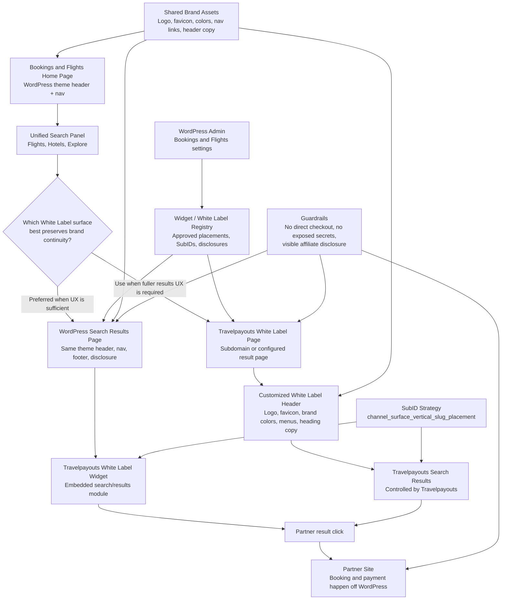

# White Label Header Continuity Diagram

This diagram shows how Bookings and Flights should keep one branded header and navigation experience while Travelpayouts controls the search/results and booking handoff layer.

## Implementation Rule

Prefer the embedded White Label Widget path because it keeps the WordPress header completely intact. Use the Page-type White Label path only when the result experience requires it, and then configure the Travelpayouts header to visually match the Bookings and Flights home site as closely as Travelpayouts allows.
