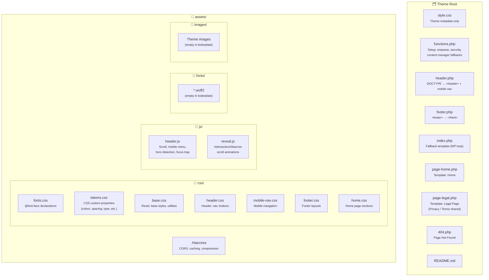
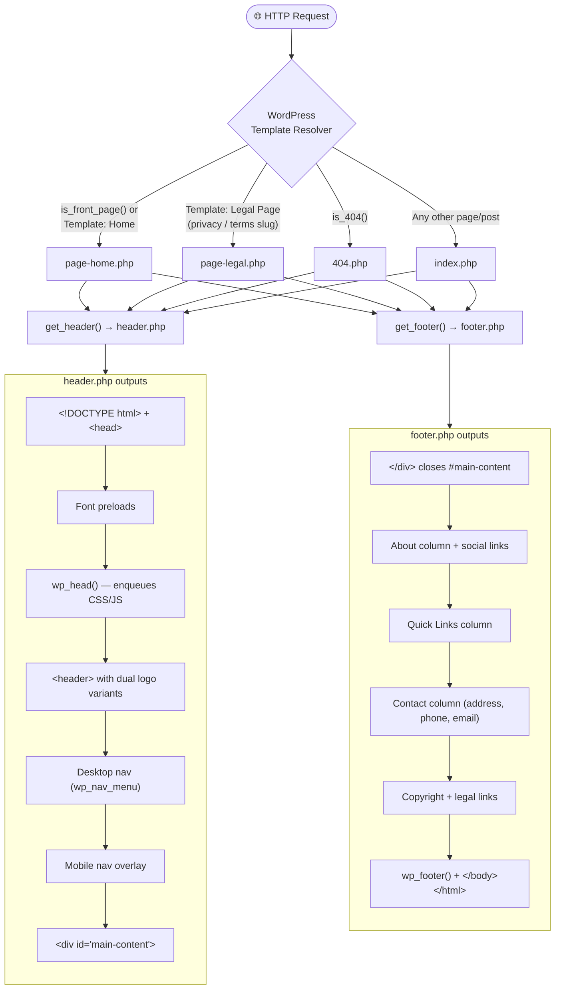
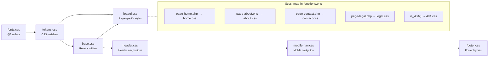
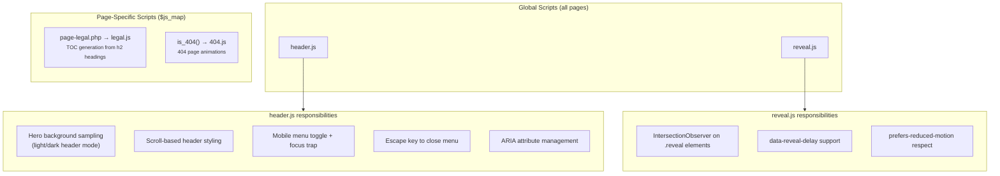
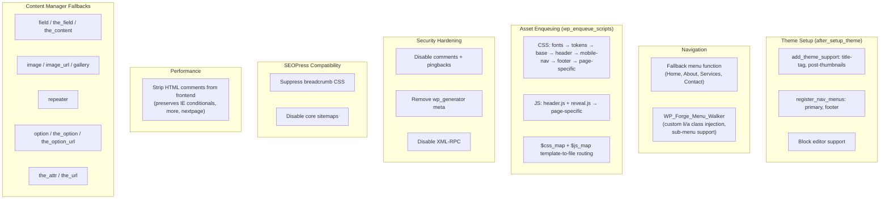
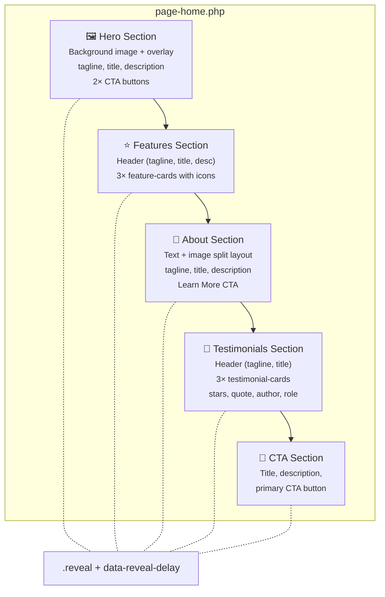
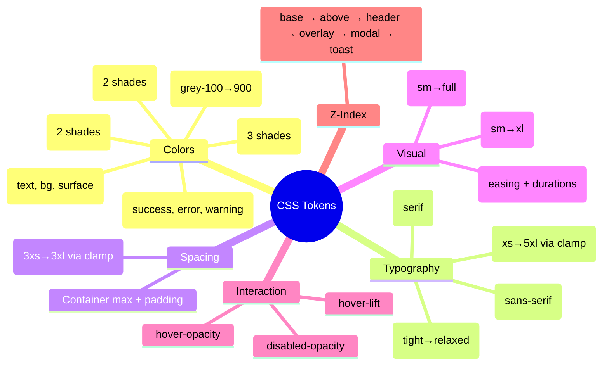
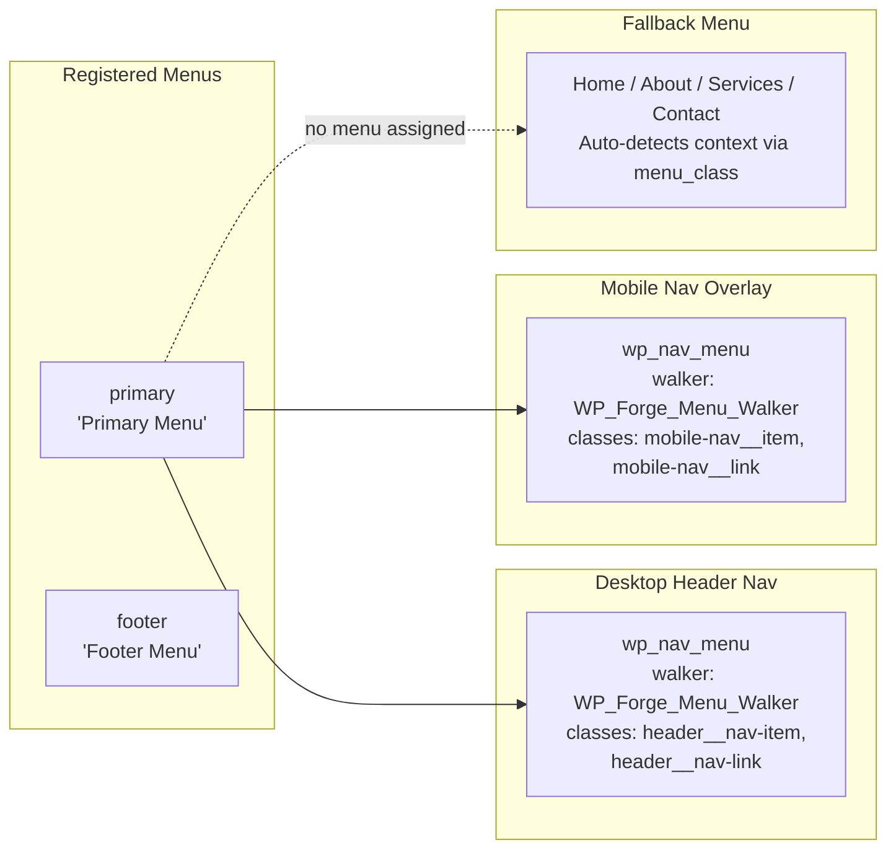
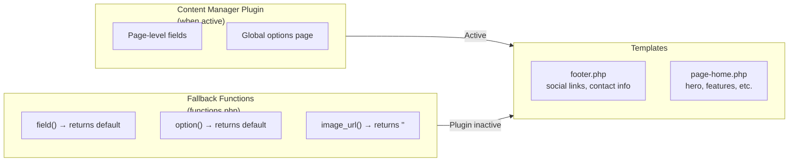
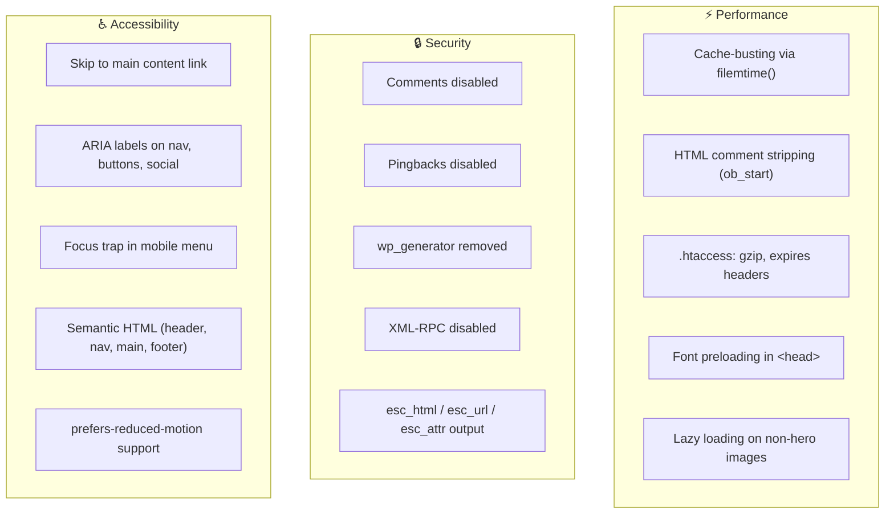

# Theme Architecture Diagram

> Auto-generated reference for the WP-Forge boilerplate theme structure.

## File Tree Overview

## Template Hierarchy & Page Rendering

## CSS Load Order & Dependencies

## JavaScript Architecture

## functions.php Internal Structure

## Home Page Sections (page-home.php)

## Design Tokens (tokens.css)

## Navigation System

## Data Flow: Content Manager Integration

## Performance & Security

